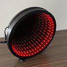
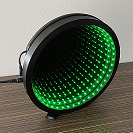
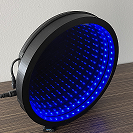
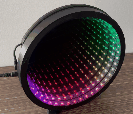
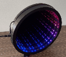
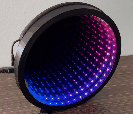
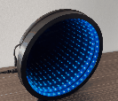

# Arduino Infinity Mirror [v1.0]

[pic1]: img/InfinityMirror-3.jpg "Infinity Mirror"
![alt-text][pic1]

## Table of Contents
* [Showcase and Features List](#showcase-and-features-list)
* [Repository Contents](#repository-contents)
* [Requirements and Materials](#requirements-and-materials)
* [Building The Mirror](#building-the-mirror)
* [Installation](#installation)
* [Usage](#usage)
* [Bugs and Known Issues](#bugs-and-known-issues)
* [License](#license)
* [Credits](#credits)

## Showcase and Features List

|  |  |  |  |  |  |  |
| ------------------------------ | ---------------------------------- | ---------------------------------- | ---------------------------------- | ---------------------------------- | ---------------------------------- | ---------------------------------- |

### Features List

* This infinity mirror features a capacitive touch sensor that will allow the user to change the LED colour pattern by tapping the plastic case near the copper tape or aluminum foil.
* The infinity mirror is fairly large measuring at almost 10 inches in diameter.
* The assembled infinity mirror conceals the Arduino Nano and all of the wiring and other components except for the power supply and a USB cable that comes out of the case and plugs into the Arduino Nano's Mini-B USB slot. 
* There are 7 colours and patterns available including:
  * Red
  * Green
  * Blue
  * Rainbow
  * Theatre Chase Rainbow
  * Rainbow Wheel
  * Rainbow Cycle Wheel

More colours and patterns may be added if desired by modifying the switch statement in the CycleChoice() function.

__Please read the [Bugs and Known Issues](#bugs-and-known-issues) section prior to building the mirror.__

## Repository Contents

* **/hardware** - Contains the fritzing file, breadboard outline, and schematic. Also contains the fusion 360 file for the 3D-printed case, and the associated stl files. Note: The original fusion 360 file was created by [The Ruiz Brothers](https://learn.adafruit.com/infinity-mirror-coaster/3d-printing). I have modified their design and included an updated fusion 360 file and .stl files.
* **/build** - Contains the .ino file for use with the Arduino IDE.
* **/img** - Contains image files for this readme.
* **/LICENSE.md** - The license file.
* **/README.md** - This readme file.

## Requirements and Materials

#### Dependencies:
* Adafruit's NeoPixel Library https://learn.adafruit.com/adafruit-neopixel-uberguide/arduino-library-installation
* Paul Badger and Paul Stoffregen's Capacitive Sensing Library https://playground.arduino.cc/Main/CapacitiveSensor/

#### Materials:
* 1 x [Arduino Nano V3](https://store.arduino.cc/usa/arduino-nano)
* 1 x [USB Type A to Mini-B cable](https://www.amazon.ca/gp/product/B004W8EIMW/ref=ppx_yo_dt_b_asin_title_o02_s00?ie=UTF8&psc=1)
* 1 x [5VDC 4A Switching Power Supply](https://www.adafruit.com/product/1466)
* 1 x [Female DC Power adapter - 2.1mm Jack to Screw Terminal Block](https://www.adafruit.com/product/368)
* 1 x [Adafruit NeoPixel Digital RGB LED Strip - Black 60 LED - BLACK](https://www.adafruit.com/product/1461?length=1)
* 1 x [1000uF 25V Electrolytic Capacitor](https://bc-robotics.com/shop/1000uf25v-electrolytic-capacitor-2/)
* 1 x [Spool of 22AWG Stranded Wire - Red](https://bc-robotics.com/shop/22-awg-stranded-wire-red/)
* 1 x [Spool of 22AWG Stranded Wire - Black](https://bc-robotics.com/shop/22-awg-stranded-wire-black/)
* 1 x [9" Diameter Mirror](https://www.amazon.com/gp/product/B005IW5CE4/ref=ppx_yo_dt_b_asin_title_o00_s00?ie=UTF8&psc=1)
* 1 x 9" Diameter Glass Two-Way Mirror (3.175mm thick) - Your local glass shop may be able to source and cut one of these.
* The following materials can be used instead of a glass two-way mirror:
  * Optional: 1 x [Acrylic (3.175mm thick)](https://www.amazon.com/dp/B004DYW31I/ref=pe_385040_30332190_pe_175190_21431760_M3T1_ST1_dp_2). Note: This must be cut into a 9" Diameter Disc. Your local glass shop may be able to do this.
  * Optional: 1 x [Gila Privacy Mirror Adhesive](https://www.amazon.com/dp/B000H5XTKG/ref=pe_385040_30332190_pe_175190_21431760_M3T1_ST1_dp_1) Note: This must be applied to the above acrylic. A guide which shows how to apply the film to the acrylic can be found [here](https://learn.adafruit.com/infinity-mirror-coaster/acrylic-setup).
* 1 x [Cryanoacrylate Super Glue](https://www.canadiantire.ca/en/pdp/lepage-all-plastics-super-glue-2-ml-0671451p.html#srp) __Warning: Use this in a well-ventilated area.__
* 1 x [1" x 18' Roll of Copper Tape](https://polymertape.com/products/copper-tape?variant=32412733734996)
* The following can be used instead of copper tape:
  * Aluminum Foil
* 1 x [100pF Capacitor](https://bc-robotics.com/shop/ceramic-capacitor-kit-250-pieces/)
* 1 x [470 Ohm Resistor](https://www.adafruit.com/product/2781)
* 4 x [100k Ohm Resistors](https://www.adafruit.com/product/2787)
* Optional but recommended:
  * To increase the sensitivity of the capacitive touch sensor, I recommend using one or more 1M ohm resistor(s) instead of the four 100k Ohm Resistors: [1M Ohm Resistors](https://www.mouser.ca/ProductDetail/Vishay-BC-Components/HVR3700001004FR500?qs=sGAEpiMZZMsPqMdJzcrNwk%2Fg3DPSHRNzI2%252BJzSBJe4c%3D)
* 1 x [Adafruit Perma-Proto 1/2 Sized Breadboard](https://www.adafruit.com/product/1609)

#### Tools:
* 1 x Soldering Iron
* 1 x Solder Wire
* 1 x Hot Glue Gun
* 1 x Wire Stripper
* 1 x Wire Cutter
* 1 x Small Philips Screwdriver

## Building The Mirror

[pic2]: hardware/InfinityMirrorSketch_bb.jpg "Infinity Mirror Breadboard Sketch"
![alt-text][pic2]

[pic3]: hardware/InfinityMirrorSketch_schem.jpg "Infinity Mirror Schematic"
![alt-text][pic3]

[pic4]: img/InfinityMirrorBuild.jpg "Infinity Mirror Build"
![alt-text][pic4]

### 3D Printing The Case

Use the attached .stl files to 3D print the case. Note that the case is approximately 10 inches in diameter and will require a fairly large printing bed.

### Assembly and Soldering

1. Drill a hole in the case for the barrel jack adapter. A 9/32" drill bit should be large enough.
2. Use hot glue to attach the barrel jack adapter to the PCB Case.
3. Drill a hole in the case between where the Arduino Nano will sit and where the copper tape or aluminum foil will be installed. This is where the USB cable will be routed. In the picture above, I didn't follow this step and drilled on the far side of the copper tape. This made it difficult to touch the capacitive touch sensor. 
4. If you purchased an arduino nano with headers then remove the metal portions of the headers. If you purchased a nano without headers, proceed to the next step.
5. Use scissors or a large wire stripper to strip the Mini-B USB cable. Remove the USB Type A head and strip the wire at this end. Remove the shielding and cut the green and white wires. Route the usb cable through the hole in the case, strip the red wire, and connect the red wire to the positive terminal of the barrel jack adapter. Strip and connect the black wire to the negative terminal of the barrel jack adapter.
6. Connect the 1000uF capacitor to the barrel jack adapter. The shorter leg is typically the cathode (- side). If you unsure which side is which then refer to the product specifications or for additional information online. __Make sure you connect the positive and negative ends of the capacitor to the positive and negative ends of the adapter respectfully. This capacitor won't tolerate reversed polarity. Failure to do so may cause the capacitor to explode or become permanently damaged.__
7. Solder the various circuits and connections on the arduino nano, copper/aluminum foil, and adafruit perma-protoboard. See the above breadboard sketch and schematic images for further information. __Note: Don't connect the LED strip's wires to the protoboard or barrel jack adapter yet. Also, if you chose to use a 1M ohm resistor: Substitute the 1M ohm resistor in place of the four 100k ohm resistors.__
8. Use hot glue to secure the perma-protoboard and the USB cable to the PCB case.
9. There are two plastic arms protruding from the case. Push the nano into these arms until it clicks in place.
10. Secure the nano with hot glue. Optional: Secure it with fasteners.
11. Remove the plastic backing on the copper tape and attach it to the case. If you chose to use aluminum foil: glue it to the case.
12. Place the two way mirror disc into the top 3D-printed ring. If one side is more reflective than the other, make sure the more reflective side will be facing the LED strip. Clean the bottom side of the mirror if necessary as it won't be accessible later.
13. Cut the NeoPixel Strip to an appropriate length. There should be markings on the strip that will show you where you can cut. If there aren't refer to the product specifications for more information. __Note: The strip should have arrows indicating the direction of data flow. Be mindful of this and try to cut the LED strip at the end that the arrows are pointing to.__
14. Use hot glue to secure the LED strip to the 3D-printed inner ring (if it is in a silicone sleeve use the Cryanoacrylate Super Glue __in a well-ventilated area - preferably outdoors. Avoid breathing in the fumes of the activator as they are toxic. Read the warning labels on the product and follow the necessary precautions.__).  See [The Ruiz Brothers' case assembly guide] (https://learn.adafruit.com/infinity-mirror-coaster/case-assembly) if you require more information on how to secure the LED strip to the inner ring.
15. Slide the inner ring into the top of the case and route the wires through the opening. If there are no wires you will need to solder them onto the LED strip.
16. Slide the back mirror into the top of the case.
17. Route the LED strip's cables through the opening in the base of the case.
__Note: If your LED strip is not a WS2812 strip then you will need to look up how to connect your strip properly. Refer to the product's specifications, or, if you bought the strip from Adafruit, refer to their product page for more information.__
18. Solder the LED strip's white wire to the perma-protoboard as per the schematic/breadboard pictures above.
19. Solder the LED strip's black wire to the Arduino's ground pin.
20. Connect the LED strip's red wire to the + side of the barrel jack adapter.
21. Connect the LED strip's black wire to the - side of the barrel jack adapter.
22. Follow the [installation](#installation) steps and test the mirror to ensure that everything works before proceeding further.
23. Use the Cryanoacrylate Super Glue to secure the top of the infinity mirror case to the base. Make sure you do so __in a well-ventilated area - preferably outdoors. Avoid breathing in the fumes of the activator as they are toxic. Read the warning labels on the product and follow the necessary precautions.__
24. Connect the USB Mini-B connector to the Arduino Nano.
25. Plug the 5VDC 4A switching power supply into the wall and Infinity Mirror and enjoy!

## Installation

1. Navigate to [arduino.cc](https://www.arduino.cc/en/software), download, and install the Arduino IDE.
2. Navigate to [Adafruit's NeoPixel Uberguide](https://www.arduino.cc/en/software) and install the Adafruit_NeoPixel libary by following the instructions on that page.
3. Alternatively, open the Arduino IDE and select Tools > Manage Libraries... > and search for "Adafruit NeoPixel".
4. Install the "Adafruit NeoPixel" library and close the library manager.
5. Navigate to the [Capacitive Sensing Library](https://playground.arduino.cc/Main/CapacitiveSensor/) on arduino.cc and download the "CapacitiveSensor04.zip".
6. Open the Arduino IDE and select Sketch > Include Library > Add .Zip Library...
7. Navigate to where the "CapacitiveSensor04.zip" was saved and select it and click "Open".
8. Navigate to this github project's [main page](https://github.com/PleioneAlpha/arduino-infinity-mirror) and select the green "Code" button > "Download ZIP".
9. Save the file and navigate to the directory it is in and extract it.
10. Navigate to the "build" folder and open "InfinityMirror.ino".
11. A window may appear stating that the file "InfinityMirror.ino" needs to be inside a sketch folder named "InfinityMirror". It will ask if you want to create this folder, move the file, and continue. Select "OK".
12. In the Arduino IDE, select File > Save As and navigate to where your arduino projects folder is. In Windows 10 this is usually located in C:\Users\<your username>\Documents\Arduino. Select "Save" and save the file.
13. Plug the Arduino Nano into your computer via a USB cable. 
14. In the Arduino IDE select Tools > Board > Arduino Nano.
15. If necessary, select Tools > Processor > ATmega328P or ATmega328(old bootloader) depending on which Arduino Nano you have.
16. Select Tools > Port > and ensure that the proper port is selected. It may appear as something similar to "COM3(Arduino Nano)".
17. In the Arduino IDE select the verify button (a checkmark in the top left corner of the window).
18. If the code verifies without any issues, click "Upload" (a button in the top left corner of the window with an arrow pointing to the right).
19. If the code throws an error due to a library not being installed, return to steps 2-7.
20. Wait for the code to upload.
21. If there weren't any errors, you may now test the infinity mirror by tapping the capacitive touch sensor.
22. If the infinity mirror doesn't change colours when the touch sensor is tapped, you will need to uncomment the // DEBUG code in the program. These are located in lines 105 - 115 and 205 - 215. A fast way to decomment the lines is by highlighting all of the lines and selecting Edit > Comment / Uncomment. 
23. To enable line numbers in the Arduino IDE, select File > Preferences > and check "Display line numbers".
24. Upload the code to the Arduino again. When the code has been uploaded, select the Serial Monitor button in the top right corner of the Arduino IDE (denoted by a small magnifying glass.
25. You will see a series of readings from the capacitive touch sensor. Note the approximate value of the sensor when you aren't touching it and when you are touching it.
26. Close the serial monitor and scroll up to line 60. Change the "CAP_SENSOR_THRESHOLD = 25;" to a value just below the reading you noted in the previous step when you were touching the capacitive touch sensor.
27. Select upload again and wait for the code to upload to the Arduino.
28. Once again, select the serial monitor button and watch the values as you press the capacitive touch sensor. If the infinity mirror's colours switch properly when you touch the plastic case near the sensor, you may now close the serial monitor.
29. Recomment lines 105 - 115 and 205 - 215 by highlighting these lines and selecting Edit > Comment / Uncomment.
30. Upload the code one more time.
31. Note: After you bond the top and bottom portions of the case of the infinity mirror with super glue, you may need to repeat steps 22 - 30 in order to re-calibrate it.

## Usage

Simply tap the plastic near where the capacitive touch sensor has been installed in order to change colours and patterns.

## Bugs and Known Issues

* Windows 10 seems to have issues connecting to the Arduino Nano via a USB cable. According to some of the forums that I read, certain drivers may need to be installed on the windows machine in order to identify and communicate with the Nano. I wasn't able to solve this issue on my windows machine so I used my linux laptop to upload the sketch to the Nano.
* __It may be simpler and more worth while to use a regular button instead of the capacitive touch sensor. This should improve reliability and will mitigate the following two issues.__
* The circuit for the capacitive touch sensor on the protoboard is sensitive to activation if the user touches the back of the infinity mirror in close proximity to this circuit. In order to fix this, it may be helpful to install some sort of insulating material underneath the protoboard or on the back of the mirror's case in order to mitigate this issue.
* The capacitive touch sensor seems to be tempermental from time to time. This may be related to the shielding issue above or it may be due to some other unknown issue.
* __The inner diameter of the 3D-printed case (where the two-way glass and regular mirror are housed) is exactly 9 inches. This means that the two-way mirror and regular mirror won't fit unless the diameter of each is reduced by 2mm. Alternatively, the fusion 360 file and stl files may be modified in order to slightly increase the inner diameter to better accomodate the mirrors.__
* The barrel plug adapter and the arduino nano are held in place by hot glue (and plastic clips in the case of the nano) but I am worried that these components may come loose in the future due to wear and tear. __I recommend using sturdier methods to fasten the barrel plug adapter, arduino nano, and protoboard to the case. such as fasteners, clips, or other methods.__

## License

This project uses the Creative Commons Attribution-ShareAlike 4.0 International Public License. For more information see the [license](LICENSE.md) file or [a simplified version of the license](https://creativecommons.org/licenses/by-sa/4.0/).

## Credits

#### This project was based on two other projects:
* [The Ruiz Brothers' NeoPixel Infinity Mirror Coaster](https://learn.adafruit.com/infinity-mirror-coaster)
  * The original case was created and shared by them in the form of a fusion 360 file. I have modified this file to increase the size of the case and added/removed other properties. Many ideas and procedures from their guide were used in this project.
* [Ben Finio's Arduino-controlled RGB LED Infinity Mirror](https://www.instructables.com/Arduino-controlled-RGB-LED-Infinity-Mirror/)
  * Ben's guide inspired me to make a larger infinity mirror than the Ruiz Brothers' coaster. Some of the items mentioned and/or used in this project were mentioned in his guide (i.e. the regular 9" mirror, the 22AWG hookup wire, the acrylic sheets, and the mirrored window tint).

#### Acknowledgements and Thank Yous:
* Adafruit for providing the [NeoPixel library](https://learn.adafruit.com/adafruit-neopixel-uberguide/arduino-library-installation) and example files.
* Phillip Burgess, Kattni Rembor, and laday ada for providing the [Adafruit NeoPixel Uberguide](https://learn.adafruit.com/adafruit-neopixel-uberguide) which has been very informative and helpful during this project.
* Paul Badger and Paul Stoffregen for creating and maintaining the [Capacitive Sensing Library](https://playground.arduino.cc/Main/CapacitiveSensor/) that was used in this project.
